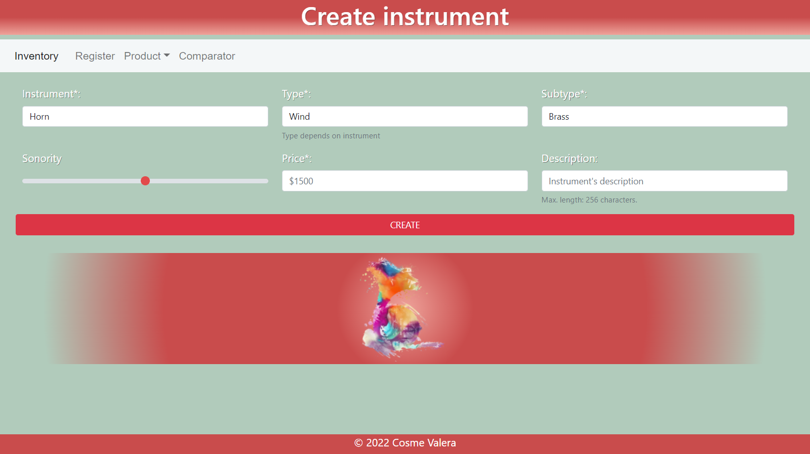
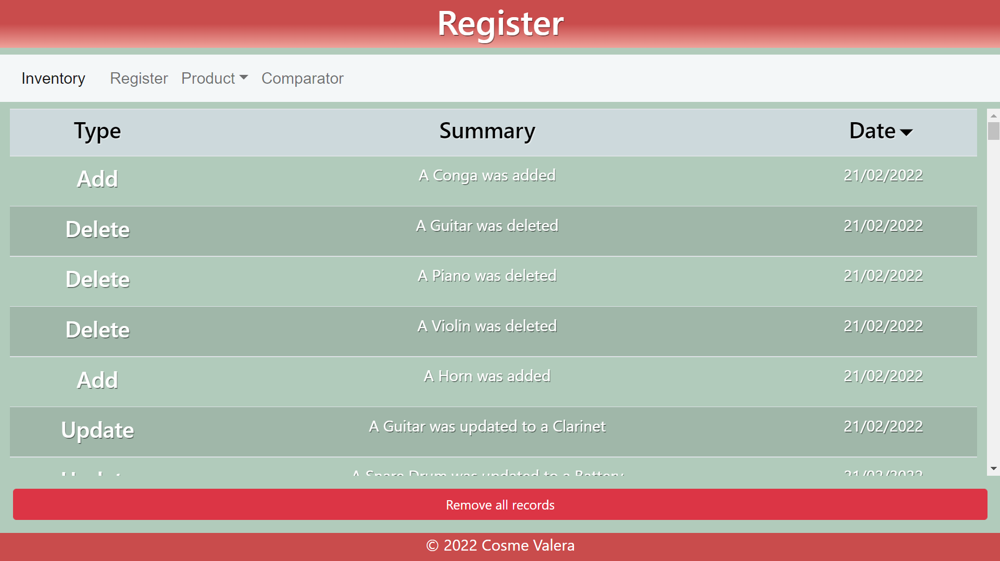
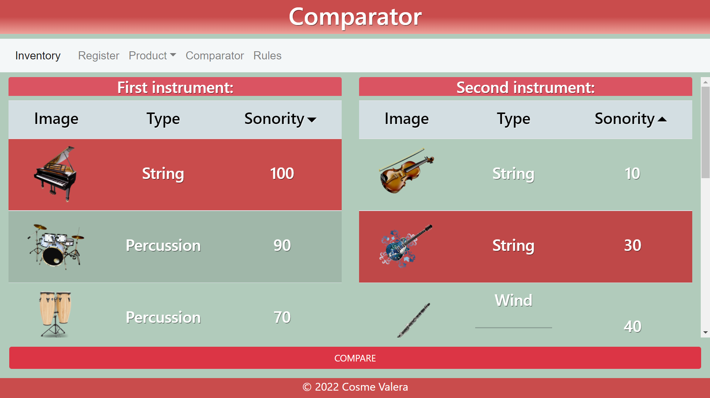
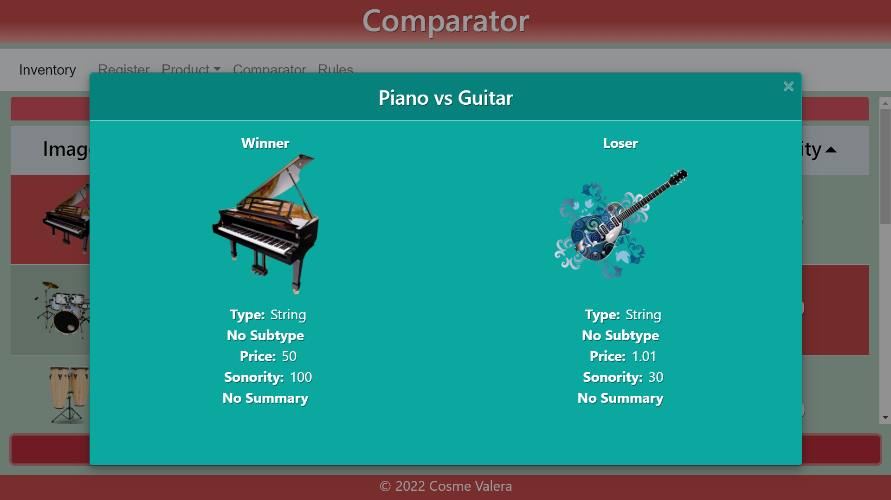

# Inventory
🎻 This project is an inventory management system for musical instruments. It provides a responsive web interface developed using HTML, CSS, JavaScript, Pug templates, Express.js, Node.js, and Mongoose for MongoDB integration.

### Screenshots:










## Tech
### 📦 Prerequisites

- Node.js (v16.13.2 or higher)
- MongoDB (5.0.4 or higher)

### 🚀 Getting Started
Follow these steps to set up and run this Node project:

1. Clone the code:
```
git clone git@github.com:CosmeValera/Inventory.git
```

2. Open your terminal and navigate to the root directory of the project.

3. Install the dependencies
```
npm install
```

4. Set Up MongoDB:

If you don't have MongoDB installed, follow the [MongoDB installation](https://www.mongodb.com/docs/manual/installation/) guide to set it up on your machine.

5. Start the project
```
node app.js
```

Open [http://localhost:3000/](http://localhost:3000/) to view it in your browser.

### 👥 Contributing
I welcome pull requests! If you're interested in collaborating or improving this project, feel free to fork the repository and submit your changes.